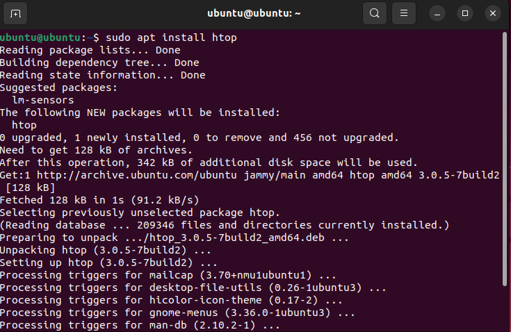
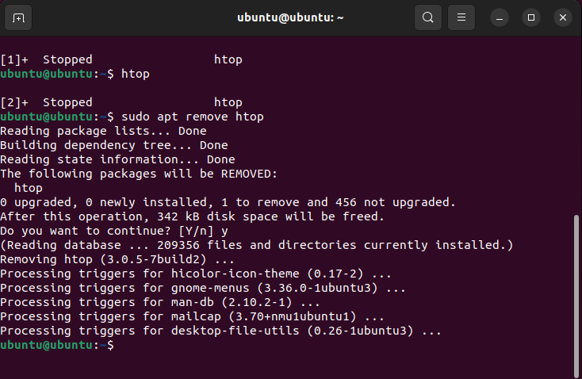
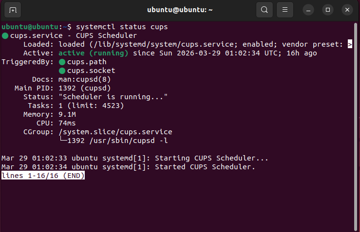
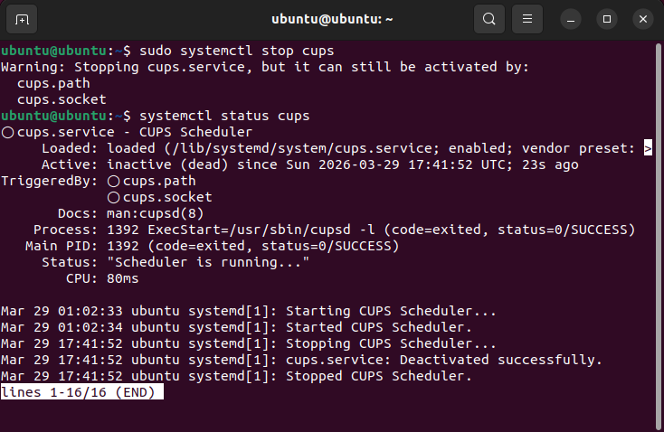
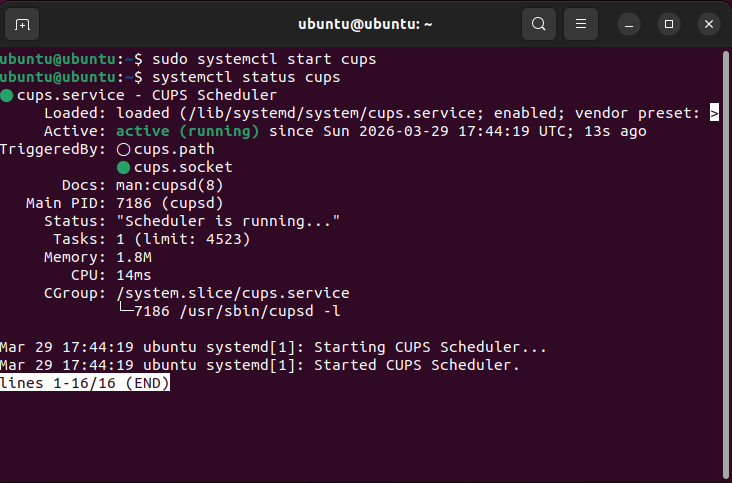
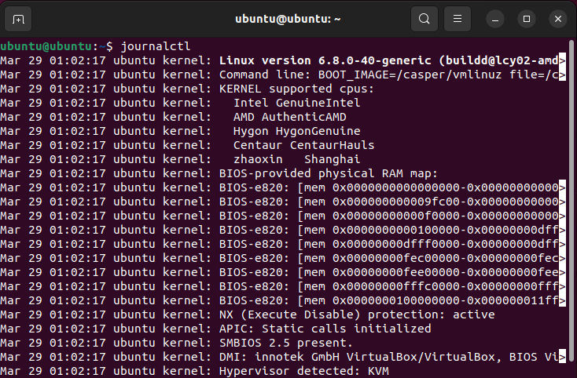
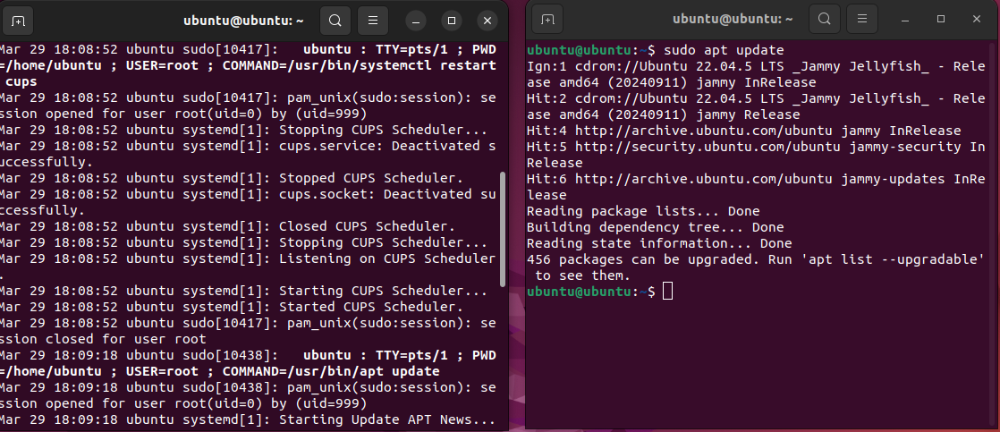

# helpdesk-lab-windows-linux
Laboratório prático simulando atividades reais de suporte técnico, com foco em comandos básicos, instalação de programas, gerenciamento de serviços e análise de logs em ambientes Windows e Linux.

---

🎯 Objetivo

Demonstrar na prática tarefas comuns do dia a dia de um profissional de suporte técnico, comparando ferramentas e comandos entre Windows e Linux.

---

🛠️ Tecnologias Utilizadas
VirtualBox
Windows
Linux (Ubuntu)
Terminal / Prompt de Comando

---

🔎 Etapas do Laboratório

## 🪟 Windows

### 1- Informações do sistema

Comando: systeminfo

---

### 2. Teste de conectividade

❌ Ping com erro

Comando: ping 192.168.0.254

✅ Ping com sucesso

Comando:
ping google.com

---

### 3. Instalação e remoção de programa

📥 Instalação

---

🗑️ Remoção

---

### 4. Gerenciamento de serviços

⏹️ Serviço Parado
 
Comando:
services.msc

▶️ Serviço rodando

---

🐧 Linux
### 1. Informações do sistema

Comando: 
uname -a

---

### 2. Teste de conectividade

❌ Ping com erro

Comando: 
ping -c 4 192.168.0.254

---

✅ Ping com sucesso

Comando: 
ping google.com

---

### 3. Instalação e remoção de programa

📥 Instalação

Comando:
sudo apt  update

---

Comando: 
sudo apt install htop

---

🗑️ Remoção

Comando: 
sudo apt remove htop

---

## 4. Gerenciamento de serviços

▶️ Serviço rodando

Comando:
systemctl status cups

---

⏹️ Serviço parado

Comando:
sudo systemctl stop cups

---

🔄 Serviço iniciado novamente

Comando:
sudo systemctl start cups

---

### 5. Visualização de logs

📸 Logs em tempo real:

Comando:
journalctl -f

---

📸 Geração de eventos:

Comando:
sudo apt update

---

📚 Aprendizados

Diagnóstico de problemas de conectividade

Interpretação de erros de rede

Instalação e remoção de programas

Gerenciamento de serviços no sistema

Análise de logs para troubleshooting

---

🧪 Conclusão

Este laboratório simulou cenários reais enfrentados por profissionais de suporte técnico, como falhas de rede, controle de serviços e análise de logs, proporcionando uma visão prática das diferenças entre Windows e Linux.

---

🚀 Autor

Projeto desenvolvido para fins de estudo em suporte técnico e infraestrutura de TI.

