# helpdesk-lab-windows-linux
Laboratório prático simulando atividades reais de suporte técnico, com foco em comandos básicos, instalação de programas, gerenciamento de serviços e análise de logs em ambientes Windows e Linux.

---

🎯 Objetivo

Demonstrar na prática tarefas comuns do dia a dia de um profissional de suporte técnico, comparando ferramentas e comandos entre Windows e Linux.

---

🛠️ Tecnologias Utilizadas
VirtualBox
Windows
Linux (Ubuntu)
Terminal / Prompt de Comando

---

🔎 Etapas do Laboratório

🪟 Windows

1- Informações do sistema

Comando: systeminfo

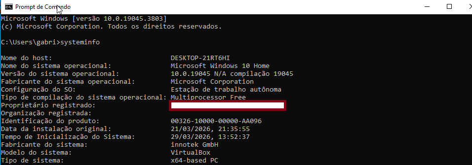

---

2. Teste de conectividade

❌ Ping com erro

Comando: ping 192.168.0.254

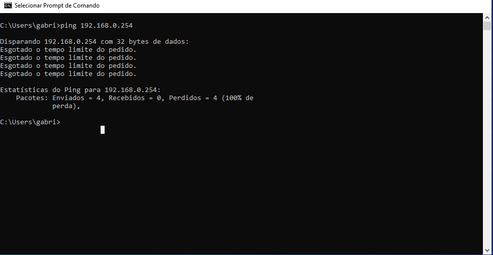

✅ Ping com sucesso

Comando:
ping google.com

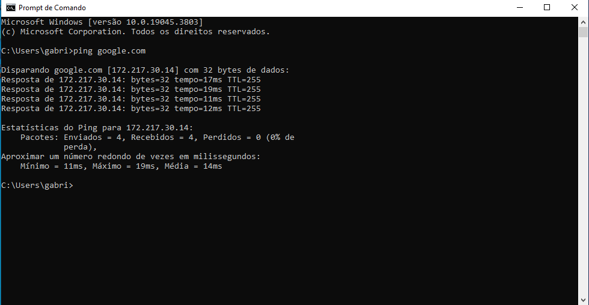

---

3. Instalação e remoção de programa

📥 Instalação

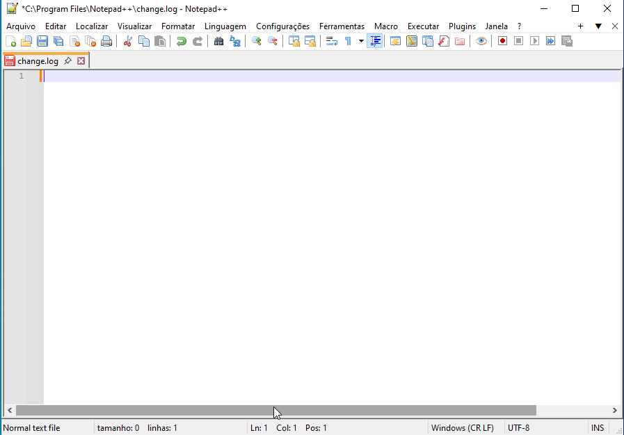

---

🗑️ Remoção

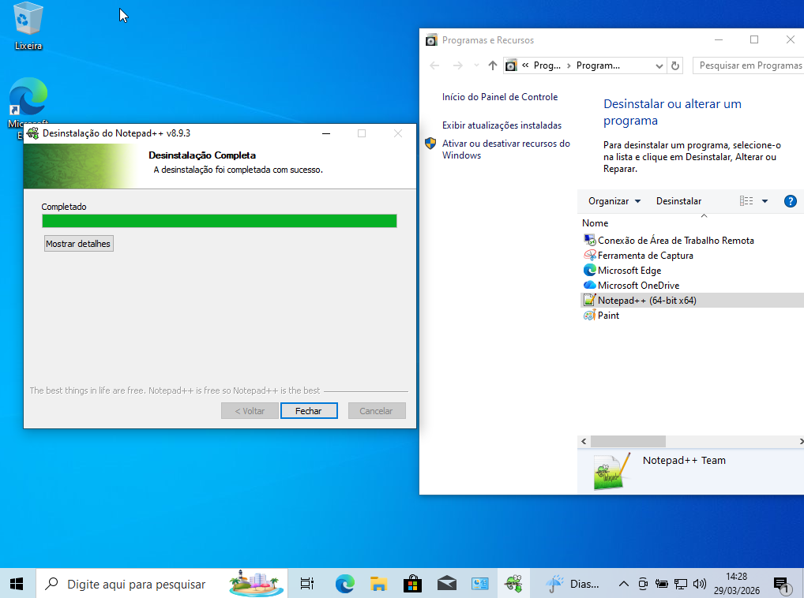

---

4. Gerenciamento de serviços

⏹️ Serviço Parado
 
Comando:
service.msc

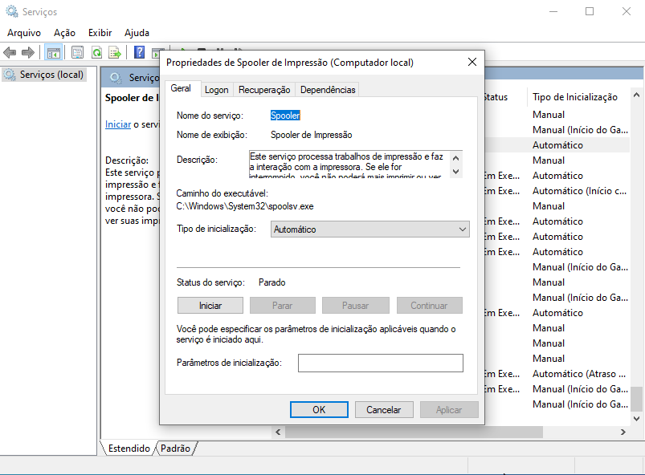

▶️ Serviço rodando

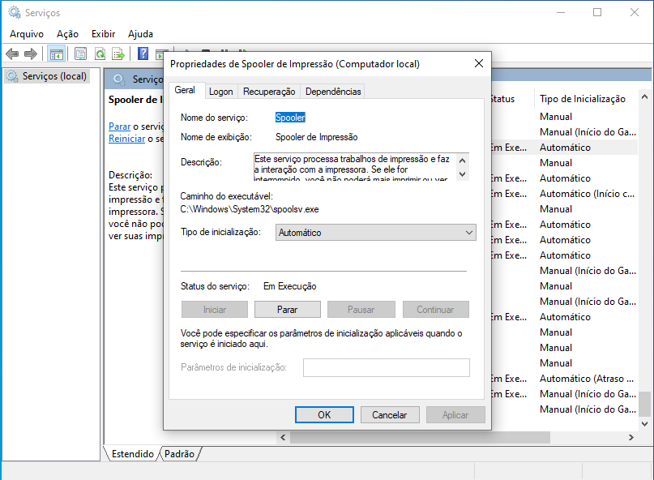

---

🐧 Linux
1. Informações do sistema

Comando: 
uname -a

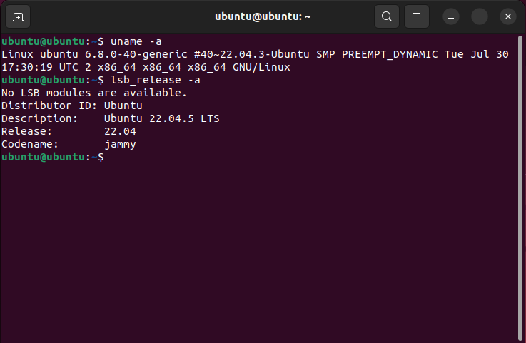

---

2. Teste de conectividade

❌ Ping com erro

Comando: 
ping -c 4 192.168.0.254

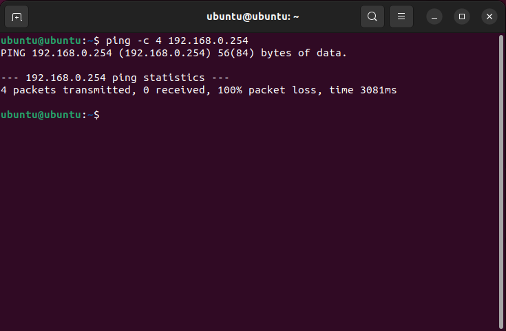

---

✅ Ping com sucesso

Comando: 
ping google.com

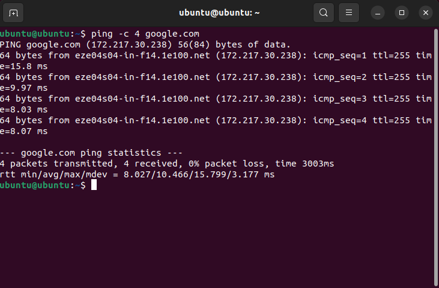

---

3. Instalação e remoção de programa

📥 Instalação

comandos:

sudo apt install 

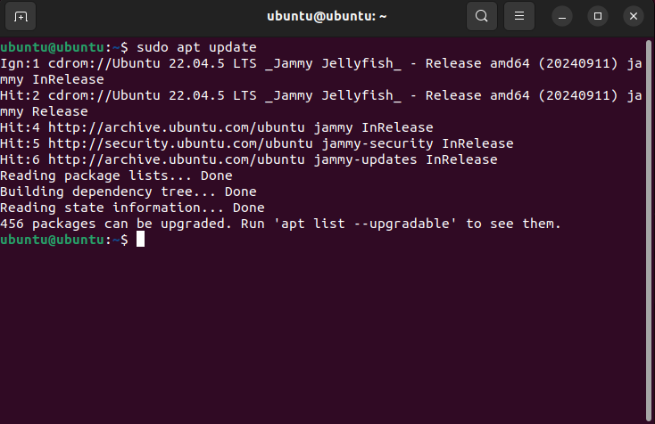

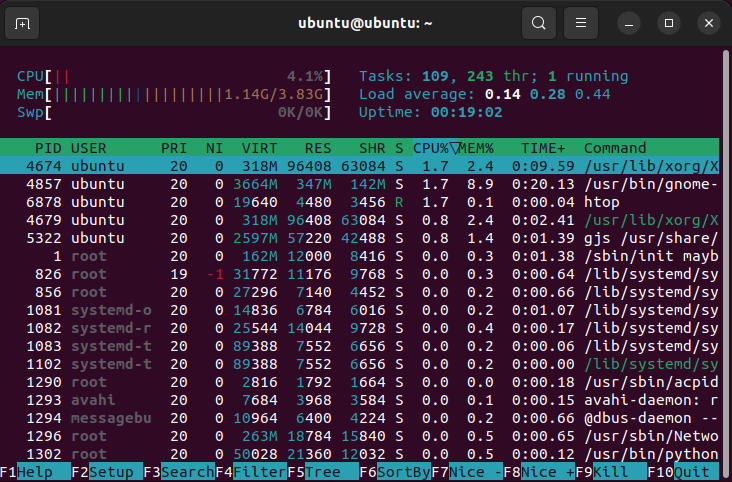

